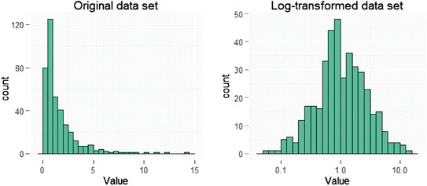
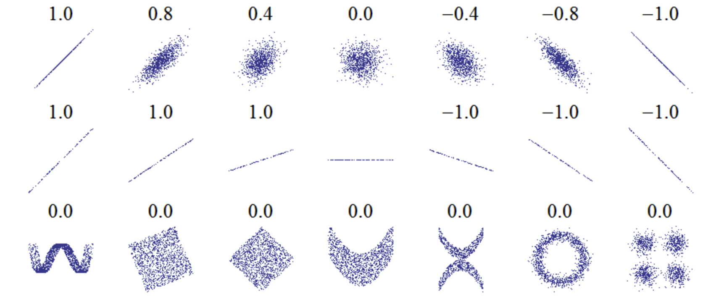

# preprocessing 
{: .no_toc }

## Table of contents
{: .no_toc .text-delta }

1. TOC
{:toc}

---

## 데이터 전처리(Preprocessing)
모든 데이터 분석 프로젝트에서 데이터 전처리는 반드시 거쳐야 하는 과정이다. 대부분의 데이터 분석가가 좋아하지 않는 과정이지만, 분석 결과/인사이트와 모델 성능에 직접적인 영향을 미치는 과정이기 때문에 중요하게 다루어지는 과정이다. 한 설문조사에 의하면, 분석가의 80% 시간을 데이터 수집 및 전처리에 사용한다고 하니, 얼마나 중요한 과정인지 짐작할 수 있다. 물론 지루하고 반복 작업의 연속이기 때문에 시간이 많이 들어가는 측면도 있을 것이다.

* 데이터 클린징 
* 결손값 처리(Null/Nan 처리)
* 데이터 인코딩(레이블, 원-핫 인코딩)
* 데이터 스케일링 
* 이상치 제거
* Feature 선택, 추출 및 가공 

## 데이터 인코딩 
머신러닝 알고리즘은 문자열 데이터 속성을 입력 받지 않으며 모든 데이터는 숫자형으로 표현되어야 합니다. 
문자형 카테고리형 속성은 모두 숫자값으로 변환/인코딩 되어야 합니다. 

* 레이블(Label) 인코딩
* 원핫(One-Hot) 인코딩 

## Label 인코딩 문제점

* 일관적인 숫자 값으로 변환되면서 예측 성능이 떨어질 수 있다.
* `선형 회귀와 같은 ML 알고리즘`에는 적용하지 않아야 함(숫자 간에도 관계가 적용된다. 높구 낮음을 단적으로 나타냄)

레이블 인코딩은 간단하게 문자열 값을 숫자형 카테고리 값으로 변환합니다. 

## 멱함수 분포 변환 (longtail)

편향된 분포를 정규분포화 시켜주기 위한 Log 변환 

### Log Or Sqrt 

많은 통계적인 기법들은 데이터의 분포가 정규분포임을 가정한 상태에서 만들어졌다. 따라서 만약 특정 데이터의 분포가 정규 분포가 아닌 편향된 분포(Longtail , 멱함수 분포 라고도 부른다.) 모양을 띈다면 이를 ``정규분포화 시켜주어야 하는 사전 작업이이 필수적``이다. 

## IQR 이상치(Outlier) 제거하기  

이상치란 자연스럽거나 기계적으로 발생하는 극단적인 값을 의미한다. 물론 이상치를 섣불리 무조건적으로 제거하는 것은 바람직하지 않지만 불필요한 데이터로 판단된다면 이상치에 포함하는 범위를 설정해주고 이 범위를 벗어나는 값들을 모두 제거해준다. 보통 범위를 설정하기 위해서는 IQR(사분위수)을 사용하는데 사분위수란, 제3사분위수에서 제1사분위수를 뺀 값을 위미한다. 

underthreshold = Q1 - (wight * 25th percentile)
overthreshold = Q3 + (wight * 75th Percentile)

## HeatMap 상관계수 
두 독립변수 x,y 사이의 상관관계의 정도를 나타내는 수치 
상관계수는 피어슨(Karl Pearson)에 의하여 제안되었기 때문에 피어슨의 상관계수라고도 한다. 
상관계수는 보통 r로 표시하며, 구하는 식은 다음과 같다. 
두 변수 (x,y)에 대하여 관측값 n 개의 짝 $(x_1,y_1),(x_2,y_2),...,(x_n,y_n)$이 주어질 때 상관계수는 다음과 같이 계산된다. 

``Cosine Similarity`` 가 생각나는 건 나만 그런건가?

$r = \frac{S_xy}{\sqrt{S_{xx}}\cdot\sqrt{S_{yy}}}$

아래와 같이 전개된다. 

$\bar{x} =\frac{1}{n}\sum xi$,  $\bar{y} =\frac{1}{n}\sum yi$  
$S_{xx}=\sum(x_i-\bar{x})^2$ 
$S_{yy}=\sum(y_i-\bar{y})^2$ 
$S_{xy}=\sum(X_i-\bar{x})(y_i-\bar{y})$

### 상관계수 특징 

* 상관계수는 -1 ~ 1 사이에 있다. 
* 상관계소의 절대값의 크기는 직선관계에 가까운 정도를 나타내고, 부호는 직선관계의 방향을 나타낸다. 
  * r > 0 - 양의 상관관계 : 산점도에서 점들이 우상향 방향으로 띠를 형성한다. 즉 한 변수의 값이 작으면 다른 변수의 값도 크다. 이러한 경향을 하나의 직선으로 나타냈을 때 그 직선의 기울기는 양수가 된다. ``두변수가 한뱡향으로 같이 움직인다``
  * r < 0 - 음의 상관관계 : 산점도에서 점들이 우하향방향으로 띠를 형성한다. 즉 한 변수의 값이 작으면 다른 변수의 값은 크가다. 이러한 경향을 하나의 직선으로 나타냈을 때 그 직선의 기울기는 음수가 된다. ``두변수가 서로 다른방향으로 움직인다``
  * r = +1 : 모든 점이 정확히 기울기가 야수인 직선 위에 위치한다. 
  * r = -1 : 모든점이 정확히 기울기가 음수인 직선 위에 위치한다. 
  * ``상관계수의 값이 1 또는 -1에 가까울 수록 두 변수 사이의 연관성이 크고, 0에 가까울 수록 매우 약함을 의미한다.``

## Sampling [Over_Under]
데이터가 불균형한 분포를 가지는 경우, 모델의 학습이 제대로 이루어지지 않을 확률이 높습니다. 이문제를 해결하기 위해 나온개념이 언더 샘플링과 오버 샘플링입니다. 불균형한(Inbalance)한 데이터인 경우 문제가 도드라집니다. 

### Smote  
대표적인 방법으로 소개할 개념은  SMOTE(Synthetic Minority Over-sampling Technique) 입니다.
SMOTE 는 낮은 비율 클래스 데이터들의 최근접 이웃을 이용하여 새로운 데이터를 생성합니다.
완전히 똑같은 특성을 가진 데이터를 복사하는 것은 의미가 없기 때문에,
아래 그림과 같이 근접해 있는 데이터들과 일정한 거리를 떨어진 위치에 데이터를 생성하는 것입니다.

## feature selection
모델의 정확도 혹은 속도 등을 위해 모든 feature를 사용하는 것이 아닌 학습에 필요한 적절한 feature만을 선택해야 좋은 결과를 바라볼수 있다. 이렇게 적절한 feature를 선택하는 과정을 feature selection 이라고 한다. 

### RFE(recusive Feature Elimination) 
모든 feature들로부터 feature를 하나하나 제거하면서 원하는 개수의 feature가 남을 때까지 이를 반복한다.즉, 학습하고 싶은 모델을 정하고, 이 모델로 모든 feature를 활용하여 데이터를 학습했을 때 (full model)의 각 feature의 ``feature importance``를 도출한다. 

### RFECV (Recursive Feature Elimination with Cross Validation)
RFE를 사용할 때에 가장 큰 단점은 몇 개의 feature를 남겨야 할 지를 사용자가 직접 정의해야 한다는 점이다. 이러한 단점을 극복하기 위해 등장한 것이 RFECV이다. RFECV(Recursive Feature Elimination with Cross Validation)는 위의 RFE가 사용하던 방법과 똑같이 가장 feature importance가 낮은 feature들을 제거해가면서 각 feature 개수마다 모델의 성능을 계산한다. 이 때, 각 feature 개수마다 K-fole validation 등의 cross validation을 활용하여 각기 다른 성능을 도출한다. 

### selectionModel 
모델학습 이후 feature importance 항목을 가시 적으로 확인 할수 있다. 선형 회계인 경우 회계계수를 반환하고, 결정트리는 컬럼에 해당하는 중요도를 반환하다. 반환된 임포턴스 항목을 이용하여 threashold 값을 선정하여 주요 픽처를 재선정시에 도움을 주는 Utillity 
``모델학습에 있어 feature imporance항목을 절대적으로 신뢰 할수 없다.``

## Permutaion Importace
RFE를 사용하여 Feature importace 항목을 계산할수 있다. REF 가장큰 단점은 데이터가 커지고 픽처가 추가됨에 따라 수행시간이 기하급수적으로 는다는것이다. 또한 REF 와 Permutaion Importace 에 가장 두드러진 차이는 학습된 모델결과를 이용하여 feature에 중요도를 계산한다는것일 것이다. 
REF : 픽처를 랜덤하게 선택해 가며 학습및 검증을 통해 수치 환산 
Permutaion : 학습된 모델에 검증데이터 항목을 변경하여 모델 결과를 수치로 환산. (검증 수치가 치아기 없으면 픽처에 중요도 낮음 , 반대로 수치 차이가 많이 발생하면 중요도가 높음) 

[scikit-learn Permutaion Importace](https://scikit-learn.org/stable/modules/permutation_importance.html)

