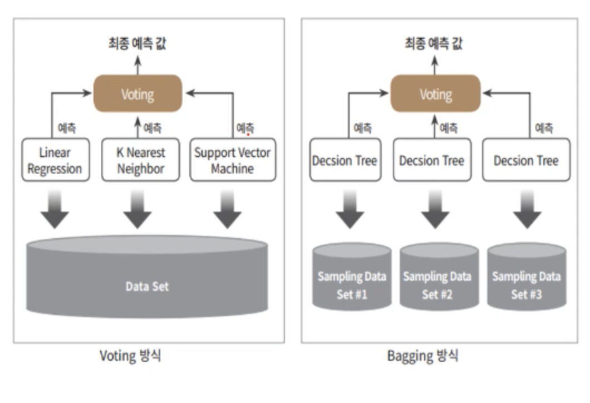
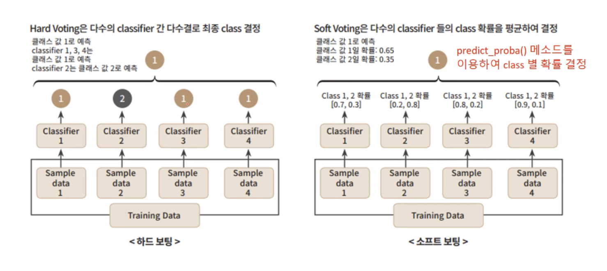

# 학습과 테스트 데이터 세트의 분리 
{: .no_toc }

## Table of contents
{: .no_toc .text-delta }

1. TOC
{:toc}

---

## 앙상블 
앙상블 학습(ensemble Learning)을 통한 분류는 여려 개의 분류기(classfier)를 생성하고 그 예측을 결합함으로써 보다 정확한 최종 예측을 도출하는 기법을 말합니다. 
어려운 문제의 결론을 내기 위해 여러 명의 전문가로 위원회를 구성해 다양한 의견을 수렴하고 결정하듯이 앙상블 학습의 목표는 다양한 분류기의 예측 결과를 결합함으로써 단일 분류기보다 신뢰성이 높은 예측값을 얻는 것입니다.
**집단지성**

## 앙상블의 유형 
앙상블의 유형은 일반적으로는 보팅(voting), 배깅(bagging), 부스팅(Boosting)으로 구분할 수 있으며, 이외에 스태킹(stacking)등의 기법이 있습니다. 

* 대표선수 배깅(Bagging) 
  * 랜덤포레스트(Random Forest) 
* 대표선수 부스팅(Boosting)
  * 에이다 부스팅 
  * 그래디언트 부스팅 (GBM)
  * XGBoost
  * LightGBM 

**정형데이터의 분류나 회귀에서는 GBM 부스팅 계열의 앙상블이 전반적으로 높은 예측 성능을 나타냅니다.**

## 앙상블의 특징 
  * 단일 모델의 약점을 다수의 모델들을 결합하여 보완 
  * 뛰어난 성능을 가진 모델들로만 구성하는 것보다 성능이 떨어지더라도 서로 다른 유형의 모델을 썩는 것이 오히려 전체 성능이 도움이 될 수 있음. 
  * 랜덤 포레스트 및 뛰어난 부스팅 알고리즘들은 모두 결정 트리 알고리즘을 기반 알고리즘으로 적용함. 
  * 결정 트리의 단점인 과적합(Overfitting)을 수십~수천개의 많은 분류기를 결합해 보완하고 장점인 직관적인 분류 기준은 강화됨. 

## 보팅(Voting)과 배깅(Bagging) 개요 
* 보팅과 배깅은 여러 개의 분류기가 투표를 통해 최종 예측 결과를 결정하는 방식입니다. 
* 보팅과 배깅의 다른 점은 보팅의 경우 일반적으로 서로 다른 알고리즘을 가진 분류기를 결합하는 것이고, 배깅의 경우 각각의 분류기가 모두 같은 유형의 알고리즘 기반이지만, 데이터 샘플링을 서로 다르게 가져가면서 학습을 수행해 보팅을 수행하는 것입니다. 

## 보팅 유형 - Hard voting Vs Soft Voting 
* 일반적으로 하드 보팅보다는 소프트 보팅이 예측 성능이 상대적으로 우수하여 주로 사용됨 
* 사이킷런은 **Votingclassfier** 클래스를 통해 보팅을 지원 

