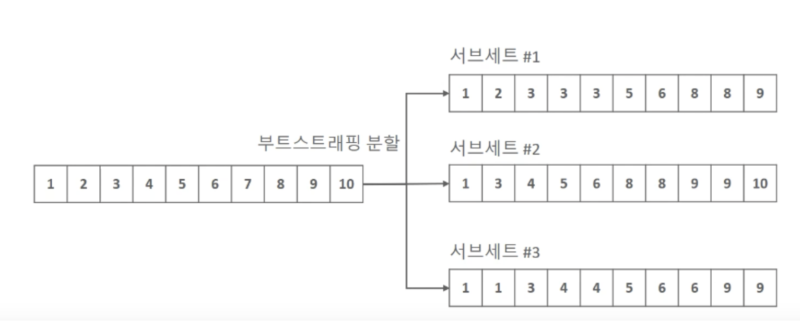

# randomforest
{: .no_toc }

## Table of contents
{: .no_toc .text-delta }

1. TOC
{:toc}

---

## Bagging - Randomforest 
배깅의 대표적인 알고리즘은 랜덤 포레스트 입니다. 랜덤 포레스트는 다재 다능한 알고리즘입니다. 앙상블 알고리즘중 비교적 빠른 수행 속도를 가지고 있으며, 다양한 영역에서 높은 예측 성능을 보이고 있습니다. 랜덤 포레스트는 여러 개의 결정 트리 분류기가 전체 데이터에서 배깅방식으로 각자의 데이터를 생플링해 겨별적으로 학습을 수행한 뒤 최종적으로 모든 분류기가 보팅을 통해 예측 결정을 하게 됩니다. 

### 랜덤 포레스트의 부트스트래핑 분할 
랜덤 포레스트는 여러개의 결정트리 분류기가 각자의 데이터를 샘플링 하여 학습한다고 하였습니다. 그 때 여러 개의 데이터 세트를 중첩되게 분리하는 것을 부트스트래핑(bootstrapping) 분할 방식이라고 합니다. 
배깅(Bagging)의 뜻도 bootstrap aggregation에서 온 말입니다. 

**부트스트래핑을 이용해 만들어진 서브세트 내 에서 중복된 데이터가 발생한다**

### 랜덤 포레스트 하이퍼 파라미터 
사이킷런은 랜덤 포레스트 분류를 위해 RandomForestClassfier 클래스를 제공합니다. 

| hiper params | desc |
|:-------------|:-----|
| n_estimators | 랜덤포레스트에서 결정 트리의 개수를 지정합니다. 디폴트는 10개입니다. 설정 높이면 성능 및 수행시간이 증가     |
| max_features | 결정 트리에 사용될 max_feature파라미터와 같습니다. Default 'auto' 는 $\sqrt{전체픽처수}$ 입니다.   |
| max_depth, min_samples_leaf | 결정 트리에서 과적합을 개선하기 위해 사용됨                                    |

