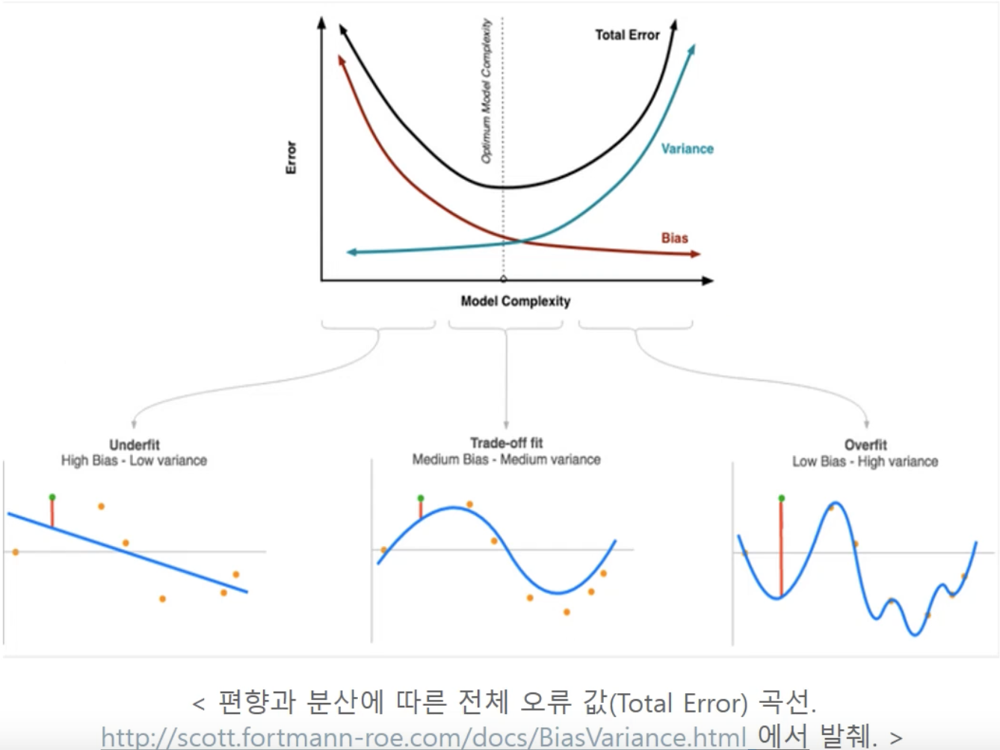

# Polynominal Regression
{: .no_toc }

## Table of contents
{: .no_toc .text-delta }

1. TOC
{:toc}

---

## PolynominalRegression 
다항 회귀는 $y=w_0+w_1\cdot{x_1}+w_2\cdot{x_2}+w_3\cdot{(x_1\cdot x_3)}+w_4\cdot{x_1}^2+w_5\cdot{x_2}^2$ 과 같이 예측자들이 1차항으로 구성된 것이 아닌, 2차항, 3차항 등으로 구성되어 있는 회귀식

## PolynomialFeatures 
원본 피처 데이터 세트를 기반으로 degree 차수에 따른 다항식을 적용하여 새로운 피처들을 생성하는 클래스 피처 엔지너어링의 기법중의 하나임.

Degree를 이용하여 모델성능을 개선할수 있지만 Degree가 과도하게 올라가면 Overfitting 이 발생한다. 

## PolynominalRegression_Bios-Variance의 Trade off 관계 
기계학습에서 예측 모형을 만드는 것은 항상 Trade off 관계를 생각해야 됩니다. 
* 과소적합  (작은 지점을 타겟팅)
  * 편향이 높구
  * 분산이 낮다 
* 과대적합  (팔랑귀 편차가 크게되며 Cost가 커진다.)
  * 편향이 낮다
  * 분산이 높다 

