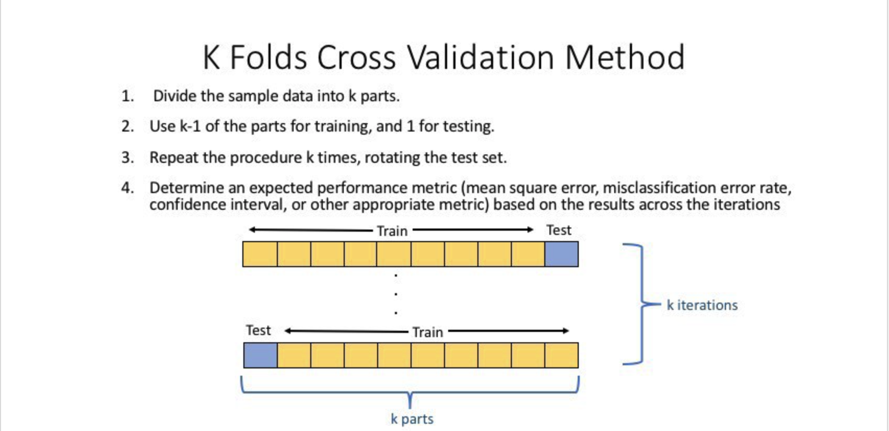
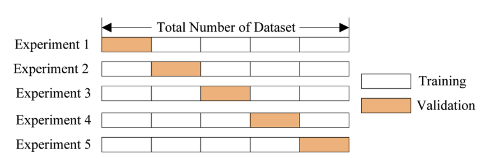
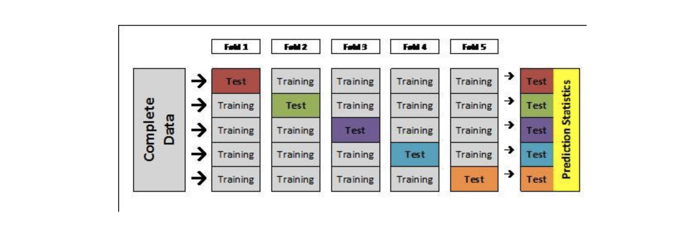

# 교차검증 
{: .no_toc }

## Table of contents
{: .no_toc .text-delta }

1. TOC
{:toc}

---

## K-fold Cross Validation Method 

정의 
* k개의 folder를 만들어서 진행하는 교차검증 
  
사용이유 
* 총 데이터 갯수가 적은 데이터 셋에 대하여 정확도를 향상시킬수 있음 
* 이는 기존에 Trainnig / Validation / Test 세개의 집단으로 분류하는 것보다, Training 과 Test로만 분류할 때 학습 데이터 셋이 더 많기 때문 
* 데이터 수가 적은데 검증과 데이터에 데이터를 더 뺏기면 `underfiiting` 등 성능이 미달되는 데일이 학습됨 

과정 
* 기존 과정과 같이 Trainnig Set 과 Test Set을 나눈다. 
* Training을 K 개의 fold로 나눈다. 
* 위는 5개의 Fold로 나눴을때 모습니다. 
* 한 개의 Fold의 있는 데이터를 다시 K개로 쪼갠다음, K-1 개는 Trainning Data, 마지막 한개는 Validation Data set으로 지정한다. 
* 모델을 생성하고 예측을 진행하여, 이에 대한 에러값을 추출한다.
* 다음 Fold에서는 Valudation셋을 바뀌서 지정하고 이전 Fold에서 Valudatuib 역활을 했던 Set은 다시 Training set으로 활용한다. 
* 이를 K번 반복한다. 

* 각각의 Fold의 시도에서 기록된 Error를 바탕으로 최적의 모델(조건)을 찾는다. 
* 해당 모델을 바탕으로 전체 Trainnig Set의 학습을 진행한다. 
* 해당 모델을 처음에 분할하였던 Test set을 활용하여 평가한다. 

단점
* 불균형한(Imbalanced) 분포도를 가진 레이블(결정 클래스)는 올바름 학습을 하지 못한다. 
* 학습 시간이 상대적으로 오래 걸린다. 

장점
* 작은 학습데이터를 이용하여 모델을 생성이 가능하다 underfiiting 해결 가능 

`stratified K-fold`는 불균형한 분포도를 가진 레이블을 기준으로 fold를 분리한다. 

