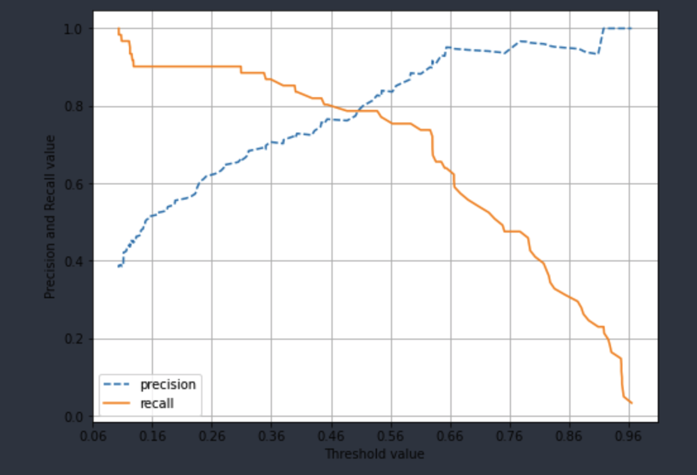
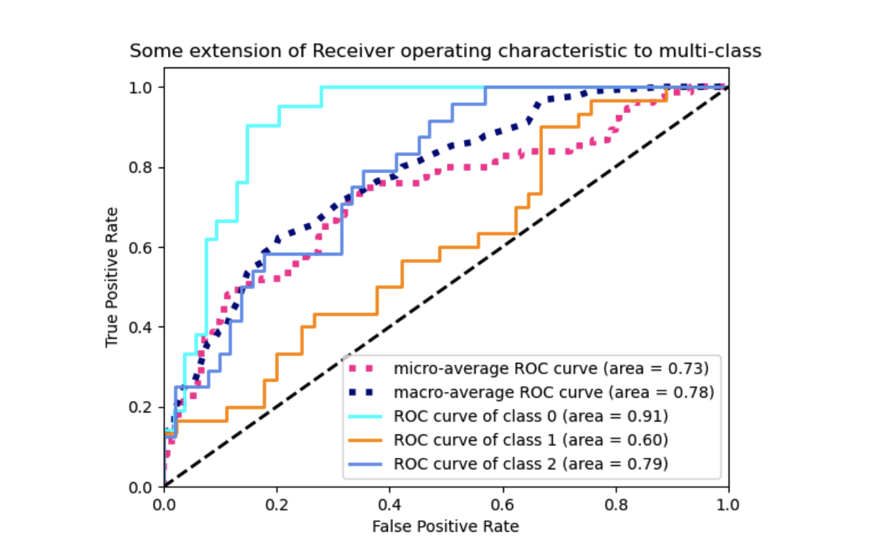

# evaluation(Classification 평가)
{: .no_toc }

## Table of contents
{: .no_toc .text-delta }

1. TOC
{:toc}

---

## 분류(Classification) 성능 평가 지표 
이진분류인 경우 고려해야할 사항이 많이 있다. 

* 정확도(Accuracy)
* 오차행령(Confusion Matrix)
  * 정밀도(Precision)
  * 재현율(Recall)
  * F1 스코어 
* ROC AUC

## 정확도 (Accuracy)
$ 정확도(Accuracy) = \frac{예측결과가 동일한 데이터 건수}{전체 예측 데이터 건수}  $

* 정확도는 직관적으로 모델 예측 성능을 나타내는 평가지표입니다. 하지만 이진 분류의 경우 데이터의 구성에 따라 ML 모델의 성능을 왜곡할 수 있기 때문에 정확도 수치 하나만 가지고 성능을 평가하지 않습니다. 
* 특히 정확도는 불균형한(Imbalanced) 레이블 값 분포에서 ML 모델의 성능을 판단할 경우, 적합한 평가 지표가 아닙니다. 
  
## 오차 행렬 (Confusion Matrix)
오차 행렬은 이진 분류의 예측 오류가 얼마인지와 더불어 어떠한 유형의 예측 오류가 발생하고 있는지를 함께 나타내는 지표입니다. 

|        -                          || 예측 클래스                                        |                        
|                     |              | Negative (0)           | Positive(1)            |
|:--------------------|:-------------|:-----------------------|:-----------------------|
| 실제클래스(ActualClass)| Negative(0)  | TN(True Negative, 00)  | FP(False Positive, 01) |
| ^^                  | Positive(1)  | FN(False Negative, 10) | TP(True Positive , 11) |

## 정밀도(Precision)과 재현율(Recall)
$정밀도=\frac{TP}{(FP+TP)}$
$재현율=\frac{TP}{(FN+TP)}$

* 정밀도는 예측을 Positive로 한 대상 중에 예측과 실제값이 Positive로 일치한 데이터의 비융을 뜻합니다. 
* 재현율은 실제 값이 Positive인 대상 중에 예측과 실제 값이 Positive로 일치한 데이터의 비율을 뜻합니다. 

#### 무슨 차이가 발생하는것일까? 
정밀도(Precision)는 수식에서 알수 있듯이 FP(False Positive) 값이 낮야야 좋은 수치를 기대할수 있다. 이와 반대로 재현율(Recall)은 FN(False Nagative)값이 낮아야 좋은 수치를 기대할수 있다. 재현율이 높다는 것은 예민한 데이터 검증에 유리하다.

재현율이 상대적으로 더 중요한 지표인 경우는 실제 Positive 양성인 데이터 예측을 Negative로 잘못 판단하게 되면 업무상 큰 영향이 발생하는 경우 Eg) 암 진단, 금융사기 판별 

정밀도가 상대적으로 더 중요한 지표인 경우는 실제 Negative 음성인 데이터 예측을 Positive 양성으로 잘못 판단하게 되면 업무상 큰 영향이 발생하는 경우: 스팸메일 

``불균형한 레이블 클래스를 가지는 이진 분류 모델에서는 많은 데이터 중에서 중점적으로 찾아야 하는 매우 적은 수의 결괏값에 Positive를 성정해 1값을 부여하고, 그렇지 않은 경우는 Negative로 0 값을 일반적으로 부여합니다. ``

분류하려는 업무의 특성상 정밀도 또는 재현율이 특별히 강조돼야 할 경우 분류의 결정 임곗값(Threshold)을 조정해 정밀도 또는 재현율의 수치를 높일 수 있습니다. 하지만 정밀도와 재현율은 상호 보완적인 평가 지표이기 때문에 어느 한쪽을 강제로 높이면 다른 하나의 수치는 떨어지기 쉽습니다. 이를 정밀도/재현율의 트레이드오프(Trade-off)라고 부릅니다. 

#### 분류 결정 임곗값 
$정밀도=\frac{TP}{(FP+TP)}$
$재현율=\frac{TP}{(FN+TP)}$

분류 결정 임곗값이 낮아질 수록 Positive로 예측할 확률이 높아짐. 재현율 증가 

* 사이킷런 Estivator 객체의 predict_proba() 메소드는 분류 결정 예측 확률을 반환 합니다. 
* 이를 이용하면 임의로 분류 결정 임곗값을 조정하면서 예측 확률을 변경할수 있습니다. 
  
### 100% 정밀도, 재현율

정밀도 
 확실한 기준이 되는 경우만 Positive로 예측하고 나머지는 모두 Negative로 예측합니다. $정밀도=\frac{TP}{(FP+TP)}$ 입니다. 전체 화자 1000명 중 확실한 positive 징후만 가진 환자는 단 1명이라고 하면 이 한 명만 Positive로 예측하고 나머지는 모두 Negative로 예측하더라도 FP는 0, TP는 1이 되므로 정밀도는 $\frac{1}{(1+0)}$ 으로 100%가 됩니다. 

재현율 
 모든 환자를 Positive로 예측하면 됩니다.$재현율=\frac{TP}{(FN+TP)}$ 이므로 전체 환자 10000명을 다 Positive로 예측하는 겁니다. 이 중 실제 양성인 사람이 30명 정도라도 TN이 수치에 포함되지 않고 FN은 아예 0 이므로 $\frac{30}{(30+0)}$으로 100%가 됩니다. 

## F1 Socre 
F1 Score는 정밀도와 재현율을 결합한 지표입니다. F1 스코어는 정밀도와 재현율이 어느 한쪽으로 치우치지 않는 수치를 나타낼 때 상대적으로 높은 값을 가집니다. F1 Score의 공식은 다음과 같습니다. 

$\mathrm{F1}=\frac{2}{\frac{1}{\mathrm{recall}} + \frac{1}{\mathrm{precision}}} = 2 * \frac{\mathrm{precision}*\mathrm{recall}}{\mathrm{precision}+\mathrm{recall}}$

## ROC 곡선과 AUC
ROC 곡선과 이에 기반한 AUC 스코어는 이진 분류의 예측 성능 측정에서 중요하게 사용되는 지표입니다. 일반적으로 의학 분야에서 많이 사용되지만, 머신러닝의 이진분류모델의 예측 성능을 판단하는 중요한 평가 지표이기도 합니다. 
AUC(Area Under Curve)값은 ROC곡선 밑의 면적을 구한 것으로서 일반적으로 1에 가까울수록 좋은 수치입니다. 100 * 100 = 1000 $\risingdotseq$ 1 

TPR은 True Positive Rate의 약자이며 이는 재현율을 나타냅니다. 따라서 TPR은 TP/(FN+TP)입니다. TPR, 즉 재현율은 민감도로도 불립니다. 
FTP은 실제 Negative(음성)을 잘못예측한 비율을 나타냅니다. 즉 실제는 Negative인데 Positive 또는 Negative로 예측한 것 중 Positive로 잘못 예측한 비율입니다. FPT = FP / (FP+TP) 입니다. 

사이킷런 ROC곡선 및 AUC 스코어 
사이킷런은 임계값에 따른 ROC 곡선 데이터를 roc_curve()로 AUC스코어를 roc_auc_score() 함수로 제공 

### API roc_curve(y_true, y_score) , roc_auc_score(y_true, y_score)
Input
{: .label .label-green }

* y_true  : 실제 클래스 값 
* y_score : predict_prob()의 반환 값 array에서 Positive컬럼의 예측 확률이 보통 사용됨 

Output 
{: .label .label-purple }

* roc_curve
  * fpr : fpr 값을 array로 반환 
  * rpr : tpr 값을 array로 반환 
  * threshold : threshold 값 array 
* roc_auc_score
  * AUC 스코어 값 

