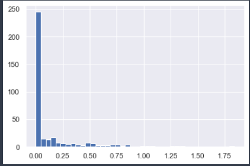

# Typography
{: .no_toc }

## Table of contents
{: .no_toc .text-delta }

1. TOC
{:toc}

---

## 비교, 마스크 및 부울 논리
이 섹션에서는 부울 마스크를 사용하여 NumPy 배열 내의 값을 검사하고 조작하는 방법을 다룹니다. 마스킹은 특정 기준에 따라 배열의 값을 추출, 수정, 계산 또는 조작하려는 경우 발생합니다. 문지방. NumPy에서 부울 마스킹은 종종 이러한 유형의 작업을 수행하는 가장 효율적인 방법입니다.

## Example: Counting Rainy Days

```python 
import numpy as np
import pandas as pd

# 팬더스를 이용하여 강수량 인치 데이터를 넘파이 배열로 추출
rainfall = pd.read_csv('data/Seattle2014.csv')['PRCP'].values
inches = rainfall / 254.0  # 1/10mm -> inches
inches.shape
    (365,)

%matplotlib inline
import matplotlib.pyplot as plt
import seaborn; seaborn.set()  # 플롯 양식 설정

plt.hist(inches, 40);
```


이 히스토그램은 데이터가 어떻게 생겼는지에 대한 일반적인 아이디어를 제공합니다. 그 명성에도 불구하고 시애틀의 대부분의 날은 2014년에 측정된 강우량이 거의 0에 가깝습니다. 그러나 이것은 우리가 원하는 정보를 제대로 전달하지 못합니다. 예를 들어, 그 해에 비오는 날이 몇 번이나 있었습니까? 그 비오는 날의 평균 강수량은 얼마입니까? 0.5인치 이상의 비가 내린 날은 며칠입니까?


## 데이터 파고들기 
ufunc를 사용하여 배열에 대해 요소별 비교를 수행한 다음 결과를 조작하여 질문에 답할 수 있습니다. 지금은 데이터를 제쳐두고 마스킹을 사용하여 이러한 유형의 질문에 신속하게 답하기 위한 NumPy의 몇 가지 일반적인 도구에 대해 논의하겠습니다.

ufuncs를 다시 떠올리면 배열에서 +, -, *, / 및 기타를 사용하면 요소별 연산이 발생한다는 것을 알았습니다. NumPy는 또한 <(보다 작음) 및 >(보다 큼)와 같은 비교 연산자를 요소별 ufunc로 구현합니다. 이러한 비교 연산자의 결과는 항상 부울 데이터 유형의 배열입니다. 6가지 표준 비교 작업을 모두 사용할 수 있습니다.

``` python 
x = np.array([1, 2, 3, 4, 5]) 
x < 3  # 보다 작음 , 객체 출력시 'dtype' 정보가 함께 출력된다. 
    array([ True,  True, False, False, False], dtype=bool)
x > 3  # 보다 큼
    array([False, False, False,  True,  True], dtype=bool)
x <= 3  # 보다 작거나 같음
    array([ True,  True,  True, False, False], dtype=bool)
x >= 3  # 보다 크거나 같음
    array([False, False,  True,  True,  True], dtype=bool)
x != 3  # 같지 않음
    array([ True,  True, False,  True,  True], dtype=bool)
x == 3  
    array([False, False,  True, False, False], dtype=bool)
(2 * x) == (x ** 2)
    array([False,  True, False, False, False], dtype=bool)
```

| Operator | Equivalent ufunc | Operator | Equivalent ufunc  |
| -------- | ---------------- | -------- | ----------------- |
| \==      | np.equal         | !=       | np.not\_equal     |
| <        | np.less          | <=       | np.less\_equal    |
| \>       | np.greater       | \>=      | np.greater\_equal |

```python 
rng = np.random.RandomState(0)
x = rng.randint(10, size=(3, 4))
x
    array([ [5, 0, 3, 3],
            [7, 9, 3, 5],
            [2, 4, 7, 6]])

x < 6
array([[ True,  True,  True,  True],
       [False, False,  True,  True],
       [ True,  True, False, False]])
```

각각의 경우 결과는 부울 배열이며 NumPy는 이러한 부울 결과로 작업하기 위한 여러 가지 간단한 패턴을 제공합니다.

### Condition With Counting 
To count the number of True entries in a Boolean array, np.count_nonzero is useful:

ted as 1:

```python 
np.count_nonzero(x < 6) # 요소 구성내용주 6보다 큰 대상 카운트 
    8

# 요소 구성 내용주 6보다 큰 대상을 찾는다. 단, 요소가 6보다 큰 대상이 boolean 형태로 변환 후 Count 대상이 된다. 
np.sum(x < 6)   
    8 

um(x < 6, axis=1) # 각 행에 6보다 작은 값은 몇 개가 있을까? 
    array([4, 2, 2])

np.any(x > 8)# 8보다 큰 값이 하나라도 있는가? Boolean 이 반환됨 
    True 

np.any(x < 0)   # 0보다 작은 값이 하나라도 있는가?
    False

np.all(x < 10)  # 모든 값이 10보다 작은가? 
    True 
 
np.all(x == 6)  # 모든 값이 6과 같은가? 
    False
``` 

``np.all`` and ``np.any`` can be used along particular axes as well. For example:

```python 
np.all(x < 8, axis=1)  # 축정보(axis=0)을 이용한다. 
    array([ True, False,  True], dtype=bool)
```

## Boolean 동작 
우리는 예를 들어 비가 4인치 미만인 모든 날 또는 2인치 이상의 비가 내리는 날을 계산하는 방법을 이미 보았습니다. 그러나 비가 4인치 미만이고 1인치 이상인 모든 날에 대해 알고 싶다면 어떻게 해야 할까요? 이것은 파이썬의 비트 논리 연산자 &, |, ^ 및 ~를 통해 수행됩니다. 표준 산술 연산자와 마찬가지로 NumPy는 (일반적으로 부울) 배열에서 요소별로 작동하는 ufunc로 이를 오버로드합니다.

```python 
np.sum((inches > 0.5) & (inches < 1))
    29

np.sum(~( (inches <= 0.5) | (inches >= 1) )) # '~' 무뉘가 어떻게 동작하는지 잘모르겠다. 
    29
```

| Operator | Equivalent ufunc | Operator | Equivalent ufunc |
| -------- | ---------------- | -------- | ---------------- |
| &        | np.bitwise\_and  | |        | np.bitwise\_or   |
| ^        | np.bitwise\_xor  | ~        | np.bitwise\_not  |

```python 
print("Number days without rain:      ", np.sum(inches == 0))
print("Number days with rain:         ", np.sum(inches != 0))
print("Days with more than 0.5 inches:", np.sum(inches > 0.5))
print("Rainy days with < 0.2 inches  :", np.sum((inches > 0) & (inches < 0.2)))
    Number days without rain:       215
    Number days with rain:          150
    Days with more than 0.5 inches: 37
    Rainy days with < 0.2 inches  : 75
```


## Boolean Arrays as Masks 
이전 섹션에서 우리는 부울 배열에서 직접 계산된 집계를 살펴보았습니다. 보다 강력한 패턴은 Boolean 배열을 마스크로 사용하여 데이터 자체의 특정 하위 집합을 선택하는 것입니다. 이전의 x 배열로 돌아가서 배열의 모든 값이 5보다 작은 배열을 원한다고 가정합니다.

```python 
x
    array([ [5, 0, 3, 3],
            [7, 9, 3, 5],
            [2, 4, 7, 6]])

x < 5 # 반환되는 결과가 Boolean 값을 취하고 있다. 
    array([ [False,  True,  True,  True],
            [False, False,  True, False],
            [ True,  True, False, False]], dtype=bool)


##################################################
# *부울 타입 Nparray를 이용하여 Selection 을 수행한다. *
# 반환된 결과는 True 에 해당 하는 결과반 반환 된다 'Demention -1'
##################################################
x[x < 5]
    array([0, 3, 3, 3, 2, 4])


# 비가 온 모든 날에 대한 마스크 생성
rainy = (inches > 0)
# 여름에 해당하는 날에 대한 마스크 생성(6월 21일은 172번째 날임)
days = np.arange(365)
summer = (days > 172) & (days < 262)

print("Median precip on rainy days in 2014 (inches):   ",
      np.median(inches[rainy]))
print("Median precip on summer days in 2014 (inches):  ",
      np.median(inches[summer]))
print("Maximum precip on summer days in 2014 (inches): ",
      np.max(inches[summer]))
print("Median precip on non-summer rainy days (inches):",
      np.median(inches[rainy & ~summer]))

    Median precip on rainy days in 2014 (inches):    0.194881889764
    Median precip on summer days in 2014 (inches):   0.0
    Maximum precip on summer days in 2014 (inches):  0.850393700787
    Median precip on non-summer rainy days (inches): 0.20078740157

```

