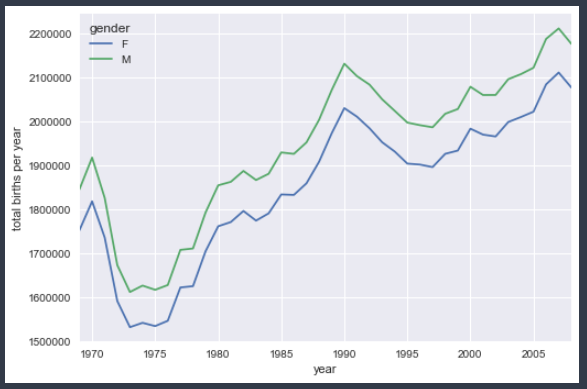

# Typography
{: .no_toc }

## Table of contents
{: .no_toc .text-delta }

1. TOC
{:toc}

---

# Pivot Tables 
GroupBy 추상화를 통해 데이터 세트 내에서 관계를 탐색하는 방법을 살펴보았습니다. 피벗 테이블은 표 형식 데이터에서 작동하는 스프레드시트 및 기타 프로그램에서 일반적으로 볼 수 있는 유사한 작업입니다. 피벗 테이블은 간단한 열 단위 데이터를 입력으로 사용하고 데이터의 다차원 요약을 제공하는 2차원 테이블로 항목을 그룹화합니다. 피벗 테이블과 GroupBy의 차이는 때때로 혼동을 일으킬 수 있습니다. 피벗 테이블을 본질적으로 GroupBy 집계의 다차원 버전으로 생각하는 데 도움이 됩니다. 즉, 분할-적용-결합이지만 분할과 결합은 모두 1차원 인덱스가 아니라 2차원 그리드에서 발생합니다.

## Motivating Pivot Tables
이 섹션의 예에서는 Seaborn 라이브러리를 통해 제공되는 **타이타닉** 승객 데이터베이스를 사용합니다.
여기에는 성별, 연령, 클래스, 지불한 요금 등을 포함하여 불행한 항해의 각 승객에 대한 풍부한 정보가 포함되어 있습니다.

```python
import numpy as np
import pandas as pd
import seaborn as sns
titanic = sns.load_dataset('titanic')

titanic.head()
    |   | survived | pclass | sex    | age | sibsp | parch | fare    | embarked | class | who   | adult_male | deck | embark_town | alive | alone |
    |---|----------|--------|--------|-----|-------|-------|---------|----------|-------|-------|------------|------|-------------|-------|-------|
    | 0 | 0        | 3      | male   | 22  | 1     | 0     | 7.25    | S        | Third | man   | TRUE       | NaN  | Southampton | no    | FALSE |
    | 1 | 1        | 1      | female | 38  | 1     | 0     | 71.2833 | C        | First | woman | FALSE      | C    | Cherbourg   | yes   | FALSE |
    | 2 | 1        | 3      | female | 26  | 0     | 0     | 7.925   | S        | Third | woman | FALSE      | NaN  | Southampton | yes   | TRUE  |
    | 3 | 1        | 1      | female | 35  | 1     | 0     | 53.1    | S        | First | woman | FALSE      | C    | Southampton | yes   | FALSE |
    | 4 | 0        | 3      | male   | 35  | 0     | 0     | 8.05    | S        | Third | man   | TRUE       | NaN  | Southampton | no    | TRUE  |

```

## Pivot Tables by Hand 
이 데이터에 대해 더 배우기 시작하려면 성별, 생존 상태 또는 이들의 조합에 따라 그룹화하는 것으로 시작할 수 있습니다.
이전 섹션을 읽었다면 ``GroupBy`` 작업을 적용하고 싶을 것입니다. 예를 들어 성별에 따른 생존율을 살펴보겠습니다. 


이것은 즉시 우리에게 약간의 통찰력을 제공합니다. 전반적으로 탑승한 여성 4명 중 3명이 생존한 반면 남성은 5명 중 1명만 생존했습니다!

이것은 유용하지만 우리는 한 단계 더 깊이 들어가서 성별과 계급에 따른 생존을 살펴보고 싶을 것입니다. GroupBy의 어휘를 사용하여 다음과 같이 진행할 수 있습니다. 클래스 및 성별로 그룹화하고, 생존을 선택하고, 평균 집계를 적용하고, 결과 그룹을 결합한 다음, 숨겨진 다차원성을 나타내기 위해 계층적 인덱스를 해제합니다. 코드에서:


```python 

titanic.groupby('sex')[['survived']].mean()
    |        | survived |
    | ------ | -------- |
    | sex    |          |
    | female | 0.742038 |
    | male   | 0.188908 |

titanic.groupby(['sex', 'class'])['survived'].aggregate('mean')
    # Index names = sex, class 
    # <class 'pandas.core.series.Series'> 
    sex     class 
    female  First     0.968085
            Second    0.921053
            Third     0.500000
    male    First     0.368852
            Second    0.157407
            Third     0.135447
    Name: survived, dtype: float64

# 세로축 성별 , 가로출 Class  
titanic.groupby(['sex', 'class'])['survived'].aggregate('mean').unstack()
    | class  | First    | Second   | Third    |
    | ------ | -------- | -------- | -------- |
    | sex    |          |          |          |
    | female | 0.968085 | 0.921053 | 0.5      |
    | male   | 0.368852 | 0.157407 | 0.135447 |

```

이 2차원 GroupBy는 Pandas가 이러한 유형의 다차원 집계를 간결하게 처리하는 편리한 루틴인 pivot_table을 포함할 정도로 충분히 일반적입니다.

## Pivot Table Syntax 
다음은 ``DataFrame``의 ``pivot_table`` 메서드를 사용한 이전 작업과 동일합니다.
이것은 ``group by`` 접근 방식보다 훨씬 더 읽기 쉽고 동일한 결과를 생성합니다. 

```python 
titanic.pivot_table('survived', index='sex', columns='class')
    # index column ='sex' , columns= 'class'
    # titanic.groupby(['sex', 'class'])['survived'].aggregate('mean').unstack() 와 동일한 데이터를 가진다.
    | class  | First    | Second   | Third    |
    | ------ | -------- | -------- | -------- |
    | sex    |          |          |          |
    | female | 0.968085 | 0.921053 | 0.5      |
    | male   | 0.368852 | 0.157407 | 0.135447 |

```

### Multi-level pivot tables 
``GroupBy``에서와 같이 피벗 테이블의 그룹화는 여러 수준과 여러 옵션을 통해 지정할 수 있습니다.
예를 들어 나이를 3차원으로 보는 데 관심이 있을 수 있습니다.
나이 ``pd.cut`` 함수를 사용하여  비닝할 것입니다. 

```python
# 카달로그 데이터로 변환.  0 ~ 18 , 18 ~ 80 
age = pd.cut(titanic['age'], [0, 18, 80]) 

# value column='survived' , index=['sex' , age] , columns = 'class'
titanic.pivot_table('survived', ['sex', age], 'class')
    |        | class    | First    | Second   | Third    |
    |--------|----------|----------|----------|----------|
    | sex    | age      |          |          |          |
    | female | (0, 18]  | 0.909091 | 1        | 0.511628 |
    |        | (18, 80] | 0.972973 | 0.9      | 0.423729 |
    | male   | (0, 18]  | 0.8      | 0.6      | 0.215686 |
    |        | (18, 80] | 0.375    | 0.071429 | 0.133663 |

```

Demention 이 증가하는걸 알수 있다 . (등급, 성별 ,나이)에 따른 데이터 분포 

열로 작업할 때도 동일한 전략을 적용할 수 있습니다. 자동으로 분위수를 계산하기 위해 pd.qcut을 사용하여 지불한 요금에 대한 정보를 추가해 보겠습니다.

``index , colums`` 정의시 순서를 고려하여 기술해야 한다. 

```python 
fare = pd.qcut(titanic['fare'], 2)
titanic.pivot_table('survived', ['sex', age], [fare, 'class'])

    |        | fare     | (-0.001, 14.454] |          |          | (14.454, 512.329] |          |          |
    |--------|----------|------------------|----------|----------|-------------------|----------|----------|
    |        | class    | First            | Second   | Third    | First             | Second   | Third    |
    | sex    | age      |                  |          |          |                   |          |          |
    | female | (0, 18]  | NaN              | 1        | 0.714286 | 0.909091          | 1        | 0.318182 |
    |        | (18, 80] | NaN              | 0.88     | 0.444444 | 0.972973          | 0.914286 | 0.391304 |
    | male   | (0, 18]  | NaN              | 0        | 0.26087  | 0.8               | 0.818182 | 0.178571 |
    |        | (18, 80] | 0                | 0.098039 | 0.125    | 0.391304          | 0.030303 | 0.192308 |
```

### Additional pivot table options 
``DataFrame``의 ``pivot_table`` 메서드의 전체 호출 서명은 다음과 같습니다.

```python
# Pandas 0.19 버전 기준 호출 시그니처
DataFrame.pivot_table(data, values=None, index=None, columns=None,
                      aggfunc='mean', fill_value=None, margins=False,
                      dropna=True, margins_name='All')
```

우리는 이미 처음 세 가지 인수의 예를 보았습니다. 여기에서 우리는 나머지 것들에 대해 간단히 살펴볼 것입니다.
두 가지 옵션인 ``fill_value``와 ``dropna``는 누락된 데이터와 관련이 있으며 매우 간단합니다. 우리는 여기에서 그 예를 보여주지 않을 것입니다.

``aggfunc`` 키워드는 적용되는 집계 유형을 제어하며, 이는 기본적으로 평균입니다.
GroupBy에서처럼 집계 사양은 몇 가지 일반적인 선택 중 하나를 나타내는 문자열일 수 있습니다(예: ``'sum'``, ``'mean'``, ``'count'``, ``'min' ``, ``'max'`` 등) 또는 집계를 구현하는 함수(예: ``np.sum()``, ``min()``, ``sum()``, 기타.).
또한 위의 원하는 옵션에 열을 매핑하는 사전으로 지정할 수 있습니다.
여기서 values 키워드를 생략했음을 주목하십시오. aggfunc에 대한 매핑을 지정할 때 이는 자동으로 결정됩니다.

```python 
titanic.pivot_table(index='sex', columns='class',
                    aggfunc={'survived':sum, 'fare':'mean'})

    |        | fare       |           |           | survived |        |       |
    |--------|------------|-----------|-----------|----------|--------|-------|
    | class  | First      | Second    | Third     | First    | Second | Third |
    | sex    |            |           |           |          |        |       |
    | female | 106.125798 | 21.970121 | 16.11881  | 91       | 70     | 72    |
    | male   | 67.226127  | 19.741782 | 12.661633 | 45       | 17     | 47    |
```

때때로 각 그룹을 따라 합계를 계산하는 것이 유용합니다. 이것은 margin 키워드를 통해 수행할 수 있습니다:
``margin``을 통해 가로 세로축에 따른 전체 합계를 구할수 있다. 

```python
titanic.pivot_table(index='sex', columns='class',
                    aggfunc={'survived':sum})
    |        | survived |          |          |
    |--------|----------|----------|----------|
    | class  | First    | Second   | Third    |
    | sex    |          |          |          |
    | female | 0.968085 | 0.921053 | 0.5      |
    | male   | 0.368852 | 0.157407 | 0.135447 |

titanic.pivot_table('survived', index='sex', columns='class', margins=True)
    | class  | First    | Second   | Third    | All      |
    |--------|----------|----------|----------|----------|
    | sex    |          |          |          |          |
    | female | 0.968085 | 0.921053 | 0.5      | 0.742038 |
    | male   | 0.368852 | 0.157407 | 0.135447 | 0.188908 |
    | All    | 0.62963  | 0.472826 | 0.242363 | 0.383838 |

```

## Example: Birthrate Data 
좀 더 흥미로운 예로 미국 질병통제예방센터(CDC)에서 제공하는 무료로 구할 수 있는 미국 출생 데이터를 살펴보자.
이 데이터는 https://raw.githubusercontent.com/jakevdp/data-CDCbirths/master/births.csv에서 찾을 수 있습니다.
(이 데이터 세트는 Andrew Gelman과 그의 그룹에 의해 다소 광범위하게 분석되었습니다. 예를 들어 
 [this blog post](http://andrewgelman.com/2012/06/14/cool-ass-signal-processing-using-gaussian-processes/)):

s데이터 다운로드를 위한 셸 명령어 - !curl -O https://raw.githubusercontent.com/jakevdp/data-CDCbirths/master/births.csv

```python
births = pd.read_csv('data/births.csv')
births.head()
    |   | year | month | day | gender | births |
    |---|------|-------|-----|--------|--------|
    | 0 | 1969 | 1     | 1   | F      | 4046   |
    | 1 | 1969 | 1     | 1   | M      | 4440   |
    | 2 | 1969 | 1     | 2   | F      | 4454   |
    | 3 | 1969 | 1     | 2   | M      | 4548   |
    | 4 | 1969 | 1     | 3   | F      | 4548   |

births['decade'] = 10 * (births['year'] // 10)
births.pivot_table('births', index='decade', columns='gender', aggfunc='sum')

%matplotlib inline
import matplotlib.pyplot as plt
sns.set()  # Seaborn 스타일 사용
births.pivot_table('births', index='year', columns='gender', aggfunc='sum').plot()
plt.ylabel('total births per year');

```


### Further data exploration (IQR 이상치(Outlier) 제거하기)
이것이 반드시 피벗 테이블과 관련이 있는 것은 아니지만 지금까지 다룬 Pandas 도구를 사용하여 이 데이터 세트에서 가져올 수 있는 몇 가지 흥미로운 기능이 더 있습니다.
잘못된 날짜(예: 6월 31일) 또는 누락된 값(예: 6월 99일)으로 인한 이상값을 제거하고 데이터를 약간 정리하는 것으로 시작해야 합니다.
이 모든 것을 한 번에 제거하는 한 가지 쉬운 방법은 이상값을 잘라내는 것입니다. 강력한 시그마 클리핑 작업을 통해 이 작업을 수행합니다.

* 4분위 수 추출 
* 1분위 수 25% 결과 확인 
* IQR 이상치 제거 
  
```python 
quartiles = np.percentile(births['births'], [25, 50, 75])
mu = quartiles[1]
sig = 0.74 * (quartiles[2] - quartiles[0])

births = births.query('(births > @mu - 5 * @sig) & (births < @mu + 5 * @sig)')

# 'day'열을 정수형으로 설정; 원래는 널 값 때문에 문자열이었음
births['day'] = births['day'].astype(int)

# 년(year), 월(month), 일(day)로부터 날짜(datetime) 인덱스를 생성 
births.index = pd.to_datetime(10000 * births.year +
                              100 * births.month +
                              births.day, format='%Y%m%d')

births['dayofweek'] = births.index.dayofweek                  
```

